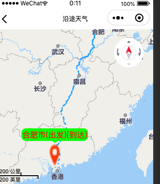
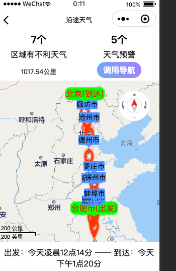
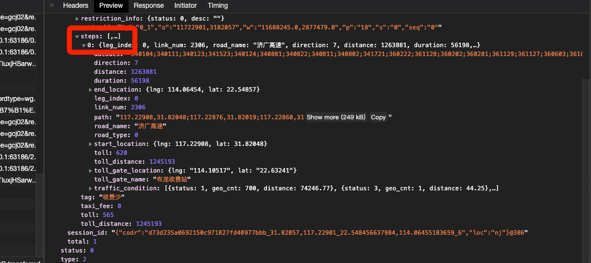
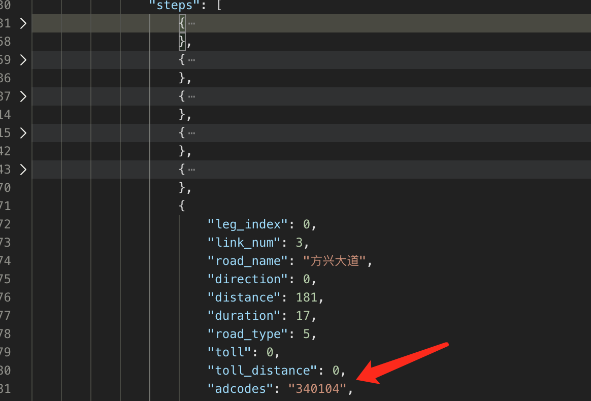

# 关于百度地图路径导航规划数据的问题

## 问题现象

今天在测试`合肥`到`深圳`路线的时候，我发现运行结果地图的marker只有一个:

而正常的路径导航结果应该是下面这样的效果，经过每段小路径的城市，我都会在第一次遇到该城市的时候，创建marker:

## 原因分析

通过分析返回的数据，我发现了问题，这是有问题的路径规划百度地图返回数据:

> 可以看到，这条路径只返回了一个step,里面包含了所有的path路径，和经过的所有`adcodes`

> 这就导致了我没办法在具体的点位上去绘制对应的城市

相对的，正常的路径返回应该是下面这样的:

可以看到，正常规划的数据是分为很多的step,基本上十几个step都还在同一个城市里。

那怎么办呢，必须兼容这样的返回数据格式。

## 处理方式

经过思考，我决定认为把这种step进行拆分，根据里程来判断该划分为多少段：

- 获取总里程，然后根据长度，每100公里(可配置)设为一个点,计算出我要拆分的段数N
- 根据N,去path列表里进行平均拆分，获取每一段的第一个点位
- 根据这N个点位，批量查询百度地图逆向编码接口，获取城市信息
- 根据城市信息设置marker信息，绘制到对应点位上

## 最终效果

待补充...